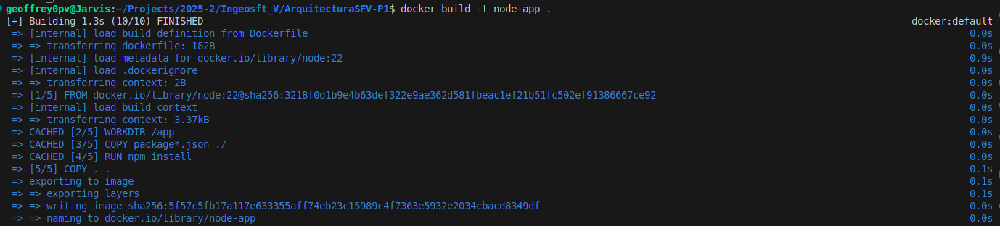
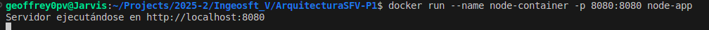
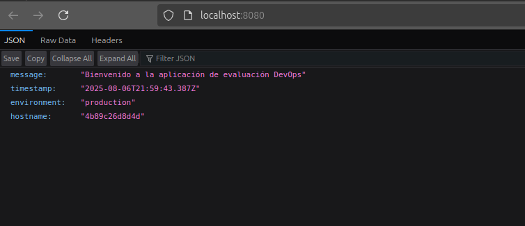

# ArquitecturaSFV-P1

# Evaluación Práctica - Ingeniería de Software V

## Información del Estudiante

* **Nombre:** Geoffrey Esteban Pasaje Vidal
* **Código:** A0380495
* **Fecha:** 06/08/2025

---

## Resumen de la Solución

Es una aplicación simple en Node.js dónde se conteneriza la imagen oficial de Node.js versión 22, disponible en el repositorio Docker Hub. Además, se implementa un script de automatización que construye la imagen y verifica el funcionamiento del servicio ejecutando pruebas y comandos dentro del contenedor.

---

## Dockerfile

En el Dockerfile primero se obtiene la imagen oficial de Node.js 22 desde Docker Hub. Luego se crea una carpeta `/app` para guardar el archivo `package.json`, el cual contiene todas las dependencias necesarias para ejecutar el servidor. Posteriormente, se instalan las dependencias usando `npm install`. Se copia el resto del código fuente al contenedor, se establecen variables de entorno (`PORT=8080`, `NODE_ENV=production`), se expone el puerto 8080 y se configura el comando `CMD` que inicia el servidor con `node index.js`.


## Script de Automatización

El script se llama `build-run.sh` y automatiza el proceso completo de construcción, ejecución y verificación del contenedor. Realiza lo siguiente:

1. Construye la imagen con `docker build`.
2. Ejecuta un contenedor con `docker run` en segundo plano.
3. Espera unos segundos para que el servidor arranque.
4. Realiza una solicitud HTTP al contenedor usando `curl`.
5. Muestra el estado del contenedor y el resultado de la prueba.

## Principios DevOps Aplicados

1. **Automatización:** Se usa un script para automatizar la construcción y prueba.
2. **Entrega continua (CD):** Se prepara una imagen lista para ser desplegada en cualquier ambiente.
3. **Infraestructura como código (IaC):** El `Dockerfile` define el entorno de ejecución de forma reproducible.

---

## Captura de Pantalla





## Mejoras Futuras

1. Configurar integración continua con GitHub Actions o Jenkins.
2. Agregar pruebas automatizadas con Jest o Mocha.
3. Parametrizar el puerto de ejecución y nombre del contenedor en el script.

---

## Instrucciones para Ejecutar

1. Clona el repositorio o descarga los archivos.
2. Abre la terminal en el directorio del proyecto.
3. Ejecuta el script con permisos de ejecución:

   ```bash
   chmod +x build-run.sh
   ./build-run.sh
   ```
4. Abre el navegador en `http://localhost:8080` para verificar que el servidor está funcionando.

---
